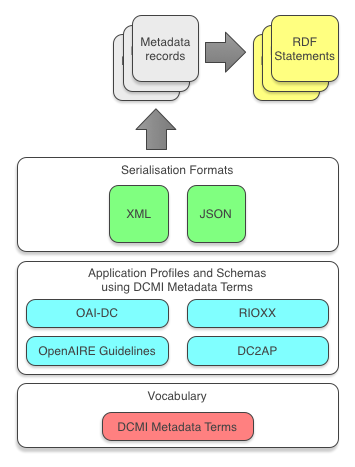

# Using Persistent Identifiers with Literals in Dublin Core-based metadata in XML

####  Proposal for a DCMI activity to recommend good practice

##### Paul Walk, Tom Baker, 2018-09-05


# About this activity

The Dublin Core Metadata Initiative (DCMI) would like to examine current practice and develop recommendations on how to provide Persistent Identifiers (PIDs) *together* with string literals in XML metadata that uses Dublin Core vocabularies.
This has been prompted by requests from several parties operating in what might be loosely described as the domain of scholarly communications. For the purposes of this activity, this domain also includes systems and operations pertaining to Open Access repositories.
In order to understand requirements, some *user stories* have been gathered in a [Github repository](https://github.com/dcmi/pids_in_dc) established for this activity. This paper builds on these, provides some context, and offers some candidate solutions - all of which are designed to facilitate discussion before and during a special meeting scheduled as part of the DCMI Conference in Porto on September 11th, 2018.

##  Examples in this paper
This paper uses the example of expressing the author of a resource with the Dublin Core property `creator`. This reflects a real and common use case in the scholarly communications domain and allows us to explore issues such as multiple authors and known versus unknown names.

# Context

##  Scholarly communications
The domain of scholarly communications relies on the exchange and long-term maintenance of metadata.  Properties from [DCMI Metadata Terms](http://dublincore.org/documents/dcmi-terms/) are used extensively in this metadata. Some widely-used metadata formats, such as [OAI-DC](http://www.openarchives.org/OAI/2.0/oai_dc.xsd), consist entirely of Dublin Core properties. While RDF and graph databases are increasingly used, metadata is still most commonly exchanged in a hierarchical serialised formats such as XML or JSON, hence the focus of this activity on XML and JSON.

##  The use of persistent identifiers (PIDs)
The advantages of using global, persistent identifiers in metadata are well understood, but adoption has been slow. In scholarly communications, there is evidence that communities and organisations are now serious about promoting the use of PIDs with a focus on:
1. identification of research outputs, such as papers and data sets,
2. identification of authors (and other contributors, including funders).

For identifying research outputs, the Digital Object Identifier (DOI) is already in very wide use, supported primarily by two DOI Registration Agencies: [CrossRef](http://www.openarchives.org/OAI/2.0/oai_dc.xsd) and [DataCite](https://www.datacite.org). There are some efforts to expand the use of this PID beyond digital objects to also identify entities such as funding organisations.
For identifying authors, the situation is less clear, with several PID systems in use, though the community is responding to a significant push to promote the use of ORCID. Other significant PID systems include [ISNI](http://www.isni.org) and [ResearcherID](http://www.researcherid.com).
That PIDs created by these systems can all be expressed as HTTP URIs allows their succinct expression in metadata.

## DCMI Metadata Terms
DCMI has published metadata terms using two *namespaces*, both of which are widely used in scholarly communications:
* **http://purl.org/dc/elements/1.1/**: the "Dublin Core Element Set", first published twenty years ago and still widely used. The [current version](http://www.dublincore.org/documents/dces/), stable since 2012, was published as ISO 15836-1:2017, "Information and documentation -- The Dublin Core metadata element set -- Part 1: Core elements"
* **http://purl.org/dc/terms/**: a more extensive set of properties and classes, which is currently being prepared for publication as ISO 15836-2.

### DCMI Metadata Terms, RDF, and XML
The canonical representations of both namespaces are expressed with the W3C RDF Vocabulary Language (RDF Schema).
The /terms/ namespace replicates the fifteen terms of the /elements/1.1/ namespace with properties somewhat more precisely defined for use in RDF applications. However, this distinction has caused some confusion over the years. Drawing lessons from ten years of implementation experience, the DCMI Usage Board is currently in the process of loosening the semantics of many properties in the /terms/ namespace. While many /terms/ properties were hitherto supposed to be used with URI values (and not directly with literal values, such as names), the usage recommendation for such properties will henceforth be to prefer URIs but that literal values, such as names, will be acceptable.
For the purposes of XML implementers, however, the differences between the /elements/1.1/ and /terms/ namespaces are irrelevant. Or to be precise, the differences between the two only become relevant when specifying a target representation in RDF for an XSLT transformation of XML metadata.  It is proposed that the form and content of such a target representation in RDF be considered out of scope, at least initially.
Bottom line: XML metadata providers cannot go wrong by using only the (more complete) /terms/ namespace, though metadata consumers should continue to recognize both.

### Scope of this activity

This activity will focus on the use of DCMI terms for which a metadata provider will likely want to provide both a PID (e.g., ORCID, ISNI, or DOI) and a literal (e.g., name, title, label, or heading).  The properties *most likely* to be relevant are:
* creator
* contributor
* identifier
* relation
* publisher

Of possible relevance are also:
* rights
* accessRights
* license
* subject

## Glossary for this activity

**PIDs expressed as HTTP URIs**.  The practice of expressing a PID in an HTTP URI form is increasingly understood as good practice by many PID systems, and this form is now recommended as the default format by, among others CrossRef and ORCID, leading to identifiers which look like `http://dx.doi.org/10.1006/jmbi.1995.0238` or `https://orcid.org/0000-0003-1541-5631`.  The phrase "HTTP URI" is intended to include HTTPS URIs.

**(Metadata) Application Profile**. Over the past fifteen years, much of the work on application profiles in the Dublin Core community has focused on profiles that are Linked Data-compatible (i.e., RDF-based). For the purposes of this activity, "application profile" may be thought of more loosely as an arrangement of metadata terms from one or more namespaces, together with a set of constraints on how they might be used (e.g. what values they might have, whether or not they may be repeated etc.). Some illustrative examples in use in scholarly communications include the  *[OpenAIRE Guidelines](https://guidelines.openaire.eu/en/latest/)*, [DataCite to Dublin Core application profile (DC2AP)](https://blog.datacite.org/datacite-to-dublin-core-application-profile/), and *[RIOXX](http://www.rioxx.net/profiles/v2-0-final/)*. In other cases, metadata providers have published XML Schemas that function more or less as application profiles, such as the [ORCID Message schema](https://github.com/ORCID/ORCID-Source/tree/master/orcid-model/src/main/resources) and the [CrossRef Query Output schema](http://data.crossref.org/reports/help/schema_doc/crossref_query_output2.0/query_output2.0.html).

**String literal**.  This refers to the value of a property, where it is a simple string of characters, rather than, for example, an HTTP URI. An example in the context of scholarly communications might be the use of an author's name, rather than the PID associated with that author, for example `<dc:creator>Walk, P</dc:creator>` instead of `<dc:creator>https://orcid.org/0000-0003-1541-5631</dc:creator>`.

**Identifying versus de-referencing**. Many PIDs in use in scholarly communications, especially of the HTTP URI variety, can be *de-referenced*. This means that, for example in the case of HTTP URIs, the URI can be 'followed' and some resource - often in the form of more metadata - can be retrieved. However, there is value in PIDs, especially the HTTP URI variety, independently of their de-referencability, as globally unique identifier strings. In many cases, the URI itself contains information about the *type* of PID being used - for example the PID `https://orcid.org/0000-0003-1541-5631` is clearly identifiable as an ORCID - without having to actually access the resource at that URI.  (We avoid here referring to a PID's 'scheme' because 'scheme' has special meaning with regard to URIs -- i.e.,'HTTP' is itself a URI 'scheme'.)

### Relationship between vocabularies, application profiles and serialisation formats
This can be illustrated with a simple layer diagram:



This diagram includes application profiles that use DCMI Metadata Terms (sometimes with other vocabularies). These can be serialised into different formats, such as XML or JSON. If compatibility with Linked Data is important, then metadata expressed in serialisation formats such as XML should be translatable into RDF statements explicitly expressing all of the relationships inherent in the XML record.

# Requirements and considerations
In preparing this position paper, we have solicited requirements in the form of *user stories* captured on a [GitHub issue tracker](https://github.com/dcmi/pids_in_dc/issues). These requirements come both from metadata *suppliers* and *consumers* operating mostly in the domain of scholarly communications. We have gathered user stories relating to academic library catalogues, collections of theses, open access repositories, and systems consuming metadata from repositories.
These user stories have been labelled to indicate, for example, whether they represent a requirement from a metadata supplier or consumer (or both).

## Requirements from suppliers and consumers of metadata

These requirements are being synthesised out of the user stories gathered at:
[https://github.com/dcmi/pids\_in\_dc/issues](https://github.com/dcmi/pids_in_dc/issues "https://github.com/dcmi/pids_in_dc/issues")
(This is an ongoing process, as more user-stories are added.)

1. **Must allow the expression of a PID *together* with a string literal:** It may be useful to express both an identifier and a string -- e.g. both the PID and name of an author -- using the same property.
2. **PIDs must be easy to parse from the XML:** The PID must be expressed as either in the *content* or in an *attribute* of an XML element.
3. **No restrictions on which PIDs can be used:** However, there is a strong trend towards using HTTP URIs and some significant advantages in doing so.
4. **The provider of the PID must be identifiable:** Not only must PIDs be identifiable as such, but the *provider* of the PID must also be identifiable. 
5. **The provenance and authenticity of PIDs should be indicated:** Some application profiles require and provide this kind of information. 

## The DCMI position

1. **Supporting semantic interoperability:** DCMI has always promoted interoperability as a core concern in metadata development and practice and believes that the best way to achieve semantic interoperability in a technologically diverse world is through use of RDF as a common data model. While XML and other formats are commonly used to exchange metadata, metadata expressed in such formats should be translatable into RDF as necessary. In practical terms, it should be possible to transform a given XML structure into a set of semantically explicit RDF statements.
2. **Using HTTP URIs:** DCMI encourages the use of HTTP URIs in metadata as good practice, likely to improve the semantic interoperability of that metadata.
3. **Being namespace agnostic:** In light of recent developments, it should be possible to use the recommendation developed in this activity with either of the DCMI namespaces (/elements/1.1/ or /terms/).
4. **Simplicity:** The recommended approach should be as simple and easily understandable as possible.
5. **Conventional:** The recommended approach should be generally applicable, rather than be tied to specific domains. This gives the approach a better chance of being widely adopted as a convention, which will increase the rate of implementation.

# Proposals for discussion

DCMI would like to offer, for discussion, two proposals about the expression of PIDs *together* with associated string literals in XML metadata based on Dublin Core. These recommendations address several, though not all, of the requirements gathered so far.
Neither approach depends entirely on using HTTP URIs for PIDs, but one requirement is only met if HTTP URIs are used. This is the requirement to be able to identify the *provider* of a PID from the metadata. When using HTTP URIs as PIDs, the provider is explicitly indicated in the PID itself. This requires that consuming systems parse the PID value, which should not be an issue as the consuming system will need to parse the XML in any case.
This recommended approach - using an ID attribute and recommending that its value be an HTTP URI - would seem to present a good compromise, offering wide interoperability while capturing enough information to be useful. Wide adoption of this simple approach would drive forward the use of PIDs in metadata to greatly improve interoperability.

## Expressing PIDs without associated string literals

The expression of PIDs without associated string literals is a trivial matter, e.g:

```xml
<dc:identifier>https://doi.org/10.5468/ogs.2016.59.1.1</dc:identifier>
```

##  Expressing PIDs *together* with associated string literals

This is the main issue to be addressed. DCMI proposes two alternative approaches to this.

### Proposal 1: Using an 'id' attribute with Dublin Core properties

The simplest approach to this would seem to be to add an ID attribute to those Dublin Core properties which do *not* constrain the value to be a literal. The following examples should illustrate this approach.

#### Example 1.1: If both PID and label are known

```xml
    <dc:creator id="https://orcid.org/0000-0003-1541-5631">Walk, Paul</dc:creator>
```

#### Example 1.2: If label is known, but PID is not

```xml
<dc:creator id="">Walk, Paul</dc:creator>
```

#### Example 1.3: If PID is known, but label is not

```xml
<dc:creator id="https://orcid.org/0000-0003-1541-5631"></dc:creator>
```

or

```xml
<dc:creator id="https://orcid.org/0000-0003-1541-5631"/>
```

#### Advantages

This approach has certain advantages. It is simple to understand and easy to remember, which should aid its adoption. It is already somewhat conventional, as the use of an ID attribute in XML is quite common. 

#### Tradeoffs

The simplicity and elegance of this approach does involve some tradeoffs. For example, in the case of (for instance) an author with two or more PIDs, there is no simple way to associate these PIDs together. 

The better approach to this situation is simply to choose one of the PIDs to use, and not to include the other. The purpose of metadata like this is, typically, to express a clear relationship between, in this example, an author and a resource being described in metadata. This is best served by the addition of a single PID for the author. The task of creating a 'same-as' association between one PID and another, or of describing the author in more detail, are separate concerns.

Another tradeoff in this approach is that it relies on a feature of XML  - the use of *attributes* - which are not present in other serialisation formats such as, notably, JSON which uses a simpler model of key/value pairs. However, translating XML elements with associated attributes to JSON is possible by simply adding deeper nesting of key/value pairs.

## Proposal 2: Using nested properties for identifiers (and possibly other information)

A different approach is to use nested properties (or 'elements' in XML terms), instead of attributes, for those Dublin Core properties which do *not* constrain the value to be a literal. This mainly involves including one or more instances of the Dublin Core property: `identifier`. The following examples should illustrate this approach.

#### Example 2.1: If both PID and label are known

```xml
<dc:creator>
	<dc:identifier>https://orcid.org/0000-0003-1541-5631</dc:identifier>
	<foaf:name>Walk, Paul</foaf:name>
</dc:creator>
```

#### Example 2.2: If label is known, but PID is not

```xml
<dc:creator>
	<foaf:name>Walk, Paul</foaf:name>
</dc:creator>
```

or, simply:

```xml
<dc:creator>Walk, Paul</dc:creator>
```

#### Example 2.3: If PID is known, but label is not

```xml
<dc:creator>
	<dc:identifier>https://orcid.org/0000-0003-1541-5631</dc:identifier>
</dc:creator>
```

#### Example 2.4: Providing multiple PIDs for the same property

```xml
<dc:creator>
	<dc:identifier>https://orcid.org/0000-0003-1541-5631</dc:identifier>
  <dc:identifier>http://paulwalk.net</dc:identifier>
	<foaf:name>Walk, Paul</foaf:name>
</dc:creator>
```

#### Advantages

This approach is still relatively simple to understand and easy to remember, which should aid its adoption. It does not require any change to the 'normal' use of Dublin Core properties as XML elements. It is also more extensible, and solves the issue of relating multiple PIDs to one concept.

#### Capturing provenance and assertions of 'authentication'

This was indicated as a requirement. If the approach of nesting properties like this is adopted, then other strategies for presenting information about provenance may be considered. This area needs further discussion.

# Discussion points
1. **Should we recommend supporting multiple PIDs for the same resource?:** There are certainly cases of resources, people etc. which have been given, and may be using, more than one PID. Should the recommendation here support the expression of more than one PID for a given resource?
2. **Should we encourage people to *only* add PIDs, and not string literals?:** The ideal of the Web architecture would support this approach, which avoid the duplication of information. In this approach, if you wanted to know the name of the author with a given PID for example, you would de-reference that PID to find this information. However, the reality is that, in many case, network latency makes this untenable.
3. **Should we try to express the 'provenance' of PIDs?:** This has been expressed as a requirement, but it is not clear what this means in practice. Expressing provenance at the level of individual attributes in an XML-formatted metadata record may require significant modelling. This topic, is therefore, suggested as an open question for discussion.

